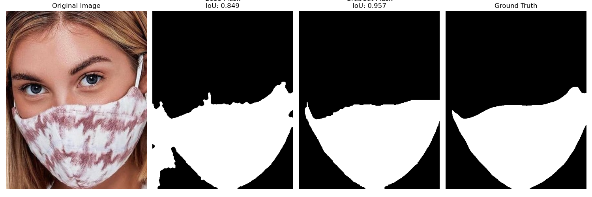
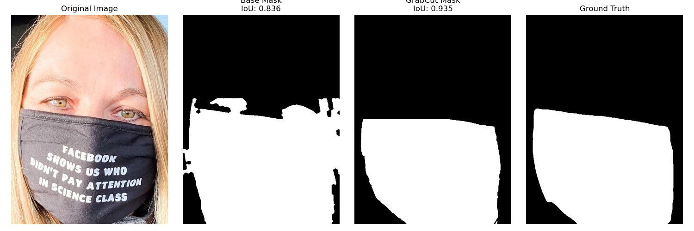
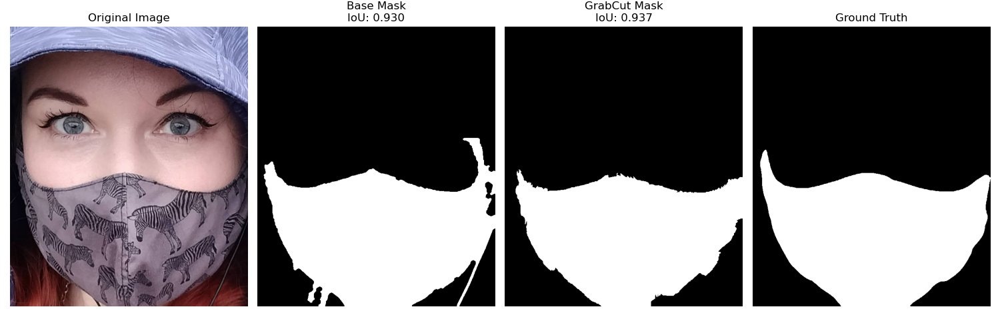
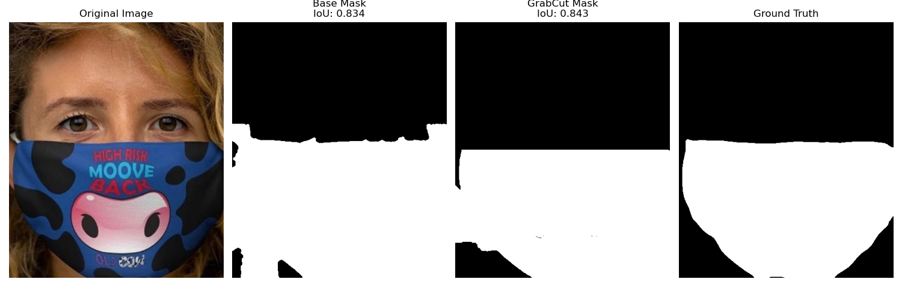
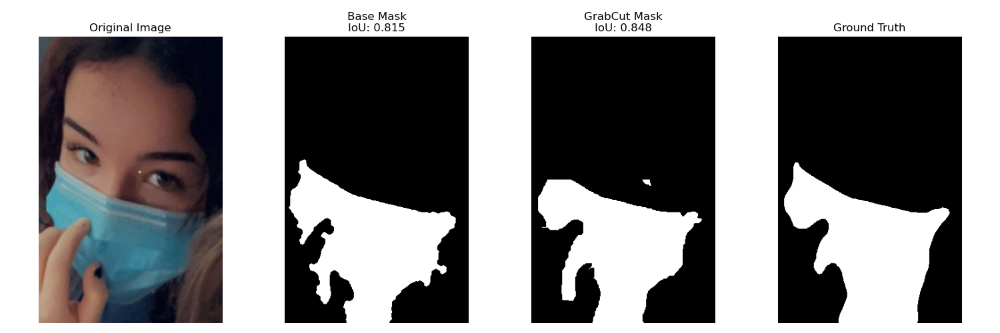
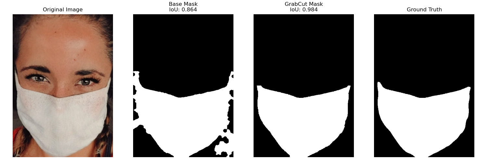
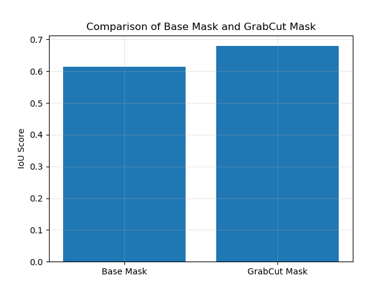
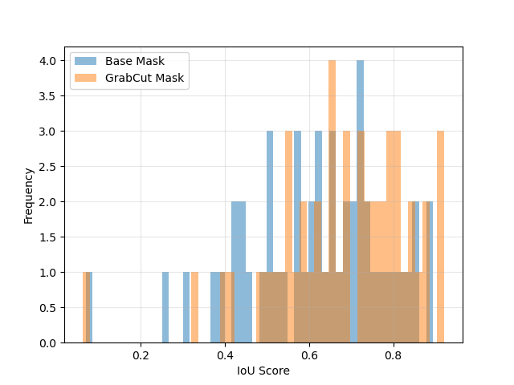

Here is the detailed README in Markdown format:

**Mask Segmentation Evaluation**
=====================================


**Overview**
------------

This repository contains a Python script `main.py` that evaluates the performance of a mask segmentation algorithm on a dataset of images and masks. The script uses OpenCV and scikit-learn libraries to load images, apply mask segmentation, and calculate Intersection over Union (IoU) scores.

The script is designed to be flexible and can be used to evaluate different mask segmentation algorithms by modifying the `segmentation` function. The script also provides options for visualizing the results and calculating IoU scores for a random sample of images.

**Requirements**
---------------

* Python 3.6+
* OpenCV 4.5+
* scikit-learn 0.24+
* NumPy 1.20+
* Matplotlib 3.4+
* tqdm (progress bar)
* argparse (command-line interface)


---

## Directory Structure

```
MSFD/
├── 1/
    ├── face_crop/               # Input images
    └── face_crop_segmentation/  # Ground truth masks
```

---

**Usage**
-----

### Running the Script

To run the script, navigate to the directory containing `main.py` and execute the following command:

```bash
cd Project_1/src/Segmentation_Task/C_Traditional_Method
```

```bash
python main.py
```
This will run the script in the default mode, processing all images in the dataset.

### Parser Options

The script uses the `argparse` library to parse command-line arguments. The following options are available:

* `--mode`: Choose the processing mode:
	+ `all`: Process all images in the dataset (default)
	+ `sample`: Process a random sample of images (see `--num` option)
* `--num`: Specify the number of images to process in sample mode (default: 50)
* `--visualize`: Specify the number of images to visualize (default: 25)


Example usage:
```bash
python main.py --mode sample --num 100 --visualize 50
```
This will process a random sample of 100 images, visualize the results for 50 images, and use a random seed of 123.


Below is the Markdown version of your LaTeX document:
 
---

## Output Metrics

The system evaluates segmentation performance using three main types of assessments:

### Per-image IoU Scores

- The Intersection over Union (IoU) metric is computed for each image, comparing:
  - The base segmentation mask (e.g., initial model output).
  - The refined segmentation mask generated using the GrabCut algorithm.
- IoU scores are stored for each image, providing a fine-grained comparison of segmentation quality.
- These scores allow for per-image analysis of segmentation improvement.

### Aggregate Statistics

- **Average IoU Scores:** Mean IoU values for both base and GrabCut-refined masks, indicating overall segmentation accuracy.
- **Improvement Percentage:** The relative increase in IoU after refinement, computed as:

  $$
  \text{Improvement (\%)} = \frac{\text{IoU (GrabCut)} - \text{IoU (Base)}}{\text{IoU (Base)}} \times 100
  $$

### Visualizations

- **Mask Comparison Images:** Overlays of base and GrabCut-refined masks on the original images, highlighting differences.
- **IoU Distribution Histograms:** Frequency distribution of IoU scores to observe performance trends.
- **Bar Chart Comparing Average Scores:** Side-by-side visualization of mean IoU scores for base and GrabCut masks.
- **Scatter Plots:** IoU improvements per image, helping identify cases where refinement was most effective.
- **Box Plots:** Showcasing IoU score distributions, outliers, and median values for both methods.

These evaluations collectively provide a comprehensive understanding of segmentation effectiveness and improvements introduced by the GrabCut refinement process.

---

## Results Directory Structure

```
results/
├── mask_comparison_*.png  # Visual comparisons
├── iou_comparison.png      # Bar chart
├── iou_distribution.png    # Histogram
└── evaluation_summary.txt  # Aggregate metrics
```

---

## Key Implementation Details

- Color space transformations between RGB, HSV, and grayscale.
- Morphological operations using an elliptical kernel.
- Contour analysis based on area thresholds.
- Parallel processing of multiple segmentation techniques.
- Memory-efficient image processing with OpenCV.

---

## Methodology Evolution

This section details the experimental approaches considered during development, their limitations, and why the final combination of base mask creation with GrabCut refinement was selected.

### Previous Approaches and Limitations

#### Color-Based Mask Segmentation

- **Implementation:** Uses HSV thresholding to detect blue and white regions in the image. Earlier, multiple color threshold ranges were provided, but it worked well only with one particular range.
- **Issues:** Failed with:
  - Variations in lighting conditions (shadows, overexposure affecting HSV values).
  - Masks with non-standard colors or patterns.
  - Over-segmentation of background regions with similar colors.
- **Example:**

  

  

  

#### Pure Edge Detection (Canny)

- **Implementation:** Edge detection without spatial constraints.
- **Issues:**
  - **Incomplete Mask Boundaries:** Edge detection primarily highlights the contours, but some mask edges may be weak or fragmented, leading to incomplete segmentation.
  - **Noise from Non-Mask Elements:** Other facial features or textures (e.g., folds in the mask) may also be detected as edges, introducing unwanted noise.
  - **Loss of Interior Information:** Unlike segmentation, edge detection does not capture the full mask region, making it difficult to distinguish the mask from the background accurately.
- **Example:**

    
  *Edge Detection*

    
  *Edge Detection*

#### Advanced Mask Segmentation

- **Implementation:** Multi-stage segmentation using LAB and HSV color spaces, edge refinement, and watershed-based boundary correction.
- **Steps:**
  - **Adaptive Color Segmentation:** Uses LAB space thresholding and HSV-based skin tone exclusion for better mask isolation.
  - **Edge Refinement:** Multi-scale Canny edge detection combined with morphological operations to enhance object boundaries.
  - **Watershed Refinement:** Uses distance transform and marker-based watershed algorithm for fine boundary segmentation.
  - **Final Contour Validation:** Filters out small, irrelevant regions and applies morphological cleanup for a smoother mask.
- **Issues:**
  - Sensitive to complex lighting conditions and shadows.
  - May struggle with masks that closely match skin tones.
  - Watershed segmentation can introduce small noise regions in low-contrast areas.
- **Example:** Transparent or patterned masks may not be segmented accurately due to irregular textures.

### Rationale for Current Methodology

The final approach combines multiple techniques to overcome individual limitations.

---

## Methodology

Our approach follows a two-stage process:

1. **Base Mask Generation:** A combination of color-based filtering, edge detection, and dominant color clustering to segment facial masks.
2. **Refinement Using GrabCut:** An iterative graph-cut algorithm to refine the mask obtained in the first step.

### Base Mask Generation

The first stage aims to create an initial segmentation mask that captures potential face masks in the image. This is achieved through a combination of techniques:

#### Color-Based Filtering

Face masks often exhibit distinct colors such as blue (surgical masks), white (N95 masks), black, gray, and brown (cloth masks). We use HSV color space thresholding to isolate these colors:

- **Blue Masks:** HSV range `[90, 50, 50]` to `[130, 255, 255]`
- **White Masks:** HSV range `[0, 0, 200]` to `[180, 30, 255]`
- **Black Masks:** HSV range `[0, 0, 0]` to `[180, 50, 50]`
- **Gray Masks:** HSV range `[0, 0, 70]` to `[180, 30, 140]`
- **Brown Masks:** HSV range `[10, 30, 60]` to `[30, 120, 150]`

A bitwise OR operation is applied to merge the masks from different color channels.

#### Edge Detection with Canny

Since masks have well-defined edges, we apply Canny edge detection on the grayscale image. A Gaussian blur is applied before edge detection to reduce noise. The detected edges are then dilated to enhance connectivity.

#### Dominant Color Clustering

Since color thresholding alone may miss some masks, we apply K-means clustering on the lower half of the image (where masks are likely to appear). We identify the most dominant color cluster and create a binary mask from it.

#### Region of Interest (ROI)

To avoid false positives, we restrict the analysis to the lower half of the image, where face masks are more likely to be present.

#### Mask Combination and Morphological Processing

The outputs from color filtering, edge detection, and clustering are combined. Morphological operations (closing and opening) are applied to remove noise and refine the mask. Finally, the largest connected component is selected as the probable face mask region.

### Refinement with GrabCut

GrabCut is a semi-supervised segmentation method based on graph cuts. It refines the base mask by distinguishing foreground (mask) from background (non-mask).

- The base mask is used to initialize the GrabCut algorithm.
- Pixels marked as 255 in the base mask are set as probable foreground, while others are considered probable background.
- Iterative optimization is performed for 5 iterations.
- The output mask is restricted to the lower half of the image to remove noise.

---

## Results and Performance

We tested this approach on 50 randomly selected images and achieved an IoU score of approximately 0.6–0.7, indicating reasonable segmentation accuracy. The combined method benefits from the robustness of heuristic-based masking and the refinement capabilities of GrabCut.

---

## Conclusion

This study explored a hybrid approach for face mask detection using a combination of heuristic-based segmentation and refinement through GrabCut. The first method provides a strong initial estimate, while the second improves accuracy. Future work may involve training a deep learning model using this approach as an initial mask generator.

---

## Examples

Below are some comparison images of masks using the best method:

  
  
  
  
  


---

## Results

For a random sample of 50 images from the dataset:





--- 

This Markdown file preserves the structure and details from the original LaTeX document.